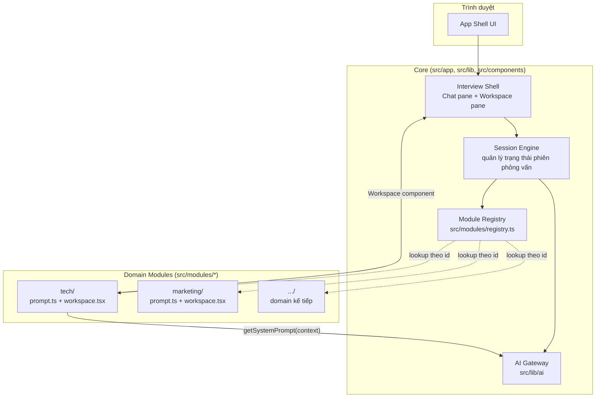
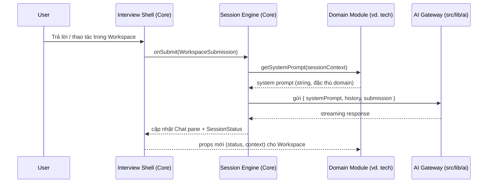

# High-Level Architecture — Vibe Check

**Status:** Source of Truth
**Owner:** Product Architecture
**Last updated:** 2026-07-25

## 1. Bối cảnh sản phẩm

Vibe Check là nền tảng **AI Mock Interview**: người dùng luyện phỏng vấn với một AI interviewer, nhận phản hồi và đánh giá theo thời gian thực. MVP tập trung vào domain **Tech** (phỏng vấn kỹ thuật: coding, system design, behavioral). Roadmap mở rộng sang **Marketing** và **Content** — mỗi domain có bộ câu hỏi, tiêu chí đánh giá, và giao diện làm bài khác nhau (coding editor vs. case-study canvas vs. content brief).

Vì mỗi domain khác nhau về *nội dung* (prompt, tiêu chí chấm) và *trải nghiệm* (UI làm bài), nhưng giống nhau về *cơ chế* (phiên phỏng vấn, hội thoại với AI, chấm điểm, lưu kết quả), kiến trúc phải tách rời hai trục này: **Core** (bất biến, dùng chung) và **Module** (thay đổi theo domain, cắm vào Core qua một hợp đồng cố định).

## 2. Nguyên tắc kiến trúc

1. **Core không biết gì về domain cụ thể.** `src/app`, `src/lib`, `src/components` không được import trực tiếp từ `src/modules/tech` hay `src/modules/marketing`. Core chỉ nói chuyện với `ModuleDefinition` — một interface trừu tượng.
2. **Module không biết gì về nhau.** `tech/` không import từ `marketing/` và ngược lại. Nếu hai domain cần dùng chung logic, logic đó phải được nâng cấp (promote) lên `src/lib`, không được import chéo giữa modules.
3. **Registry là biên giới duy nhất** giữa Core và Modules. Đây là nơi duy nhất trong codebase liệt kê tường minh tất cả các domain đang tồn tại.
4. **Thêm một domain mới = thêm một entry trong registry.** Không có nghiệp vụ nào khác trong Core cần sửa để domain mới hoạt động.
5. **Static import trước, dynamic import sau.** MVP dùng static import trong registry để đơn giản và type-safe tối đa. Khi số lượng domain tăng và bundle size trở thành vấn đề, registry chuyển sang lazy-loading (`next/dynamic` hoặc React `lazy`) mà **không đổi contract** — đây là lý do interface phải chặt ngay từ đầu.

## 3. Sơ đồ kiến trúc tổng quan



**Đọc sơ đồ:** Core không bao giờ trỏ thẳng vào `Tech`/`Marketing` (không có mũi tên đặc từ Shell/SessionEngine vào các box domain) — mọi truy cập đều đi qua `Registry`. Ngược lại, module cung cấp dữ liệu (`getSystemPrompt`) và UI (`Workspace`) ngược lên cho Core sử dụng.

## 4. Luồng dữ liệu (Data Flow)

### 4.1. Khởi tạo phiên phỏng vấn

1. Người dùng chọn domain (vd. "Tech") trên màn hình chọn domain.
2. Core gọi `getModule("tech")` từ `registry.ts`.
3. Registry trả về một `ModuleDefinition` — nếu `id` không tồn tại, Core hiển thị trạng thái "domain không khả dụng" (không throw runtime error ở tầng UI).
4. Core khởi tạo `InterviewSessionContext` (level, focus areas, locale...) từ input người dùng / hồ sơ.
5. Core render `Shell` gồm hai pane cố định: **Chat pane** (hội thoại) và **Workspace pane** (render `module.Workspace` với props chuẩn hoá).

### 4.2. Vòng lặp hội thoại (mỗi lượt hỏi–đáp)



**Điểm mấu chốt:** `Engine` không parse hay diễn giải nội dung của `systemPrompt` hay `submission` — nó chỉ chuyển tiếp (pass-through) theo interface đã định nghĩa. Toàn bộ "tri thức nghiệp vụ" (câu hỏi gì, chấm thế nào) nằm trong module, không nằm trong Core.

### 4.3. Kết thúc phiên & lưu kết quả

Core chịu trách nhiệm lưu trữ (persist) session (bảng chung: `sessions`, `messages`), module chỉ cung cấp phần diễn giải điểm số/nhận xét đặc thù domain thông qua cùng một `ModuleDefinition`. Chi tiết schema lưu trữ nằm ngoài phạm vi tài liệu này (sẽ có `docs/data-model.md` khi bước sang giai đoạn triển khai persistence).

## 5. Registry Pattern

`src/modules/registry.ts` là **service locator** tối giản: một `Record<string, ModuleDefinition>` được build tại module-load time từ danh sách import tường minh.

```ts
export const moduleRegistry: Record<string, ModuleDefinition> = {
  [techModule.id]: techModule,
  [marketingModule.id]: marketingModule,
};
```

Lý do chọn pattern này thay vì filesystem-based auto-discovery (vd. quét thư mục `src/modules/*` lúc build):

- **Tường minh > ma thuật.** Muốn biết app có bao nhiêu domain, đọc một file duy nhất — không cần hiểu build-time codegen.
- **Type-safe theo mặc định.** TypeScript suy luận được toàn bộ union type của `id` từ registry, không cần string literal rời rạc.
- **Kiểm soát thứ tự & điều kiện bật/tắt.** Dễ dàng thêm feature flag (`process.env.ENABLE_MARKETING_MODULE`) ngay tại registry mà không đụng vào module.

Khi số lượng domain vượt quá ~8–10, cân nhắc chuyển sang cơ chế đăng ký qua `defineModule()` + auto-collect bằng convention (xem mục 2, nguyên tắc 5) — nhưng contract tiêu thụ (`ModuleDefinition`) giữ nguyên.

## 6. Ranh giới thư mục (Directory Boundaries)

| Thư mục | Vai trò | Được phép import từ | Không được import từ |
|---|---|---|---|
| `src/app` | Routing, layout, page composition | `src/lib`, `src/components`, `src/modules/registry` | `src/modules/<domain>` trực tiếp |
| `src/components/ui` | Shadcn/UI primitives, không chứa business logic | — | `src/modules/*`, `src/lib/ai` |
| `src/lib` | Helper thuần, cấu hình AI, dùng chung cho mọi domain | (không phụ thuộc ngược vào app/modules) | `src/modules/*` |
| `src/modules/<domain>` | Prompt + Workspace UI đặc thù domain | `src/modules/types`, `src/lib` | `src/modules/<domain-khác>` |
| `src/modules/registry.ts` | Điểm nối duy nhất Core ↔ Modules | tất cả `src/modules/<domain>` | — |

Ranh giới này nên được enforce bằng ESLint (`no-restricted-imports` theo path pattern) khi codebase đủ lớn để vi phạm xảy ra ngoài ý muốn — ghi nhận như technical debt, chưa cấu hình ở giai đoạn tài liệu này.

## 7. Tại sao kiến trúc này hỗ trợ multi-domain

- Thêm domain **Marketing** hay **Content** không đòi hỏi hiểu Session Engine hay AI Gateway hoạt động thế nào — chỉ cần implement đúng `ModuleDefinition` (xem `interface-contracts.md`).
- Rủi ro regression khi thêm domain mới bị giới hạn trong chính folder domain đó, vì không có shared mutable state giữa các module.
- Core có thể phát triển độc lập (vd. thêm tính năng ghi âm, chấm điểm bằng giọng nói) mà không cần từng domain thay đổi, miễn là các bổ sung đó không phá vỡ `ModuleDefinition` hiện có (xem nguyên tắc versioning trong `interface-contracts.md`).

## 8. Tài liệu liên quan

- [`interface-contracts.md`](./interface-contracts.md) — contract chi tiết mọi module phải tuân thủ.
- [`user-stories.md`](./user-stories.md) — phạm vi MVP và roadmap.
- [`design-system.md`](./design-system.md) — nguyên tắc UI cho Chat pane và Workspace pane.
